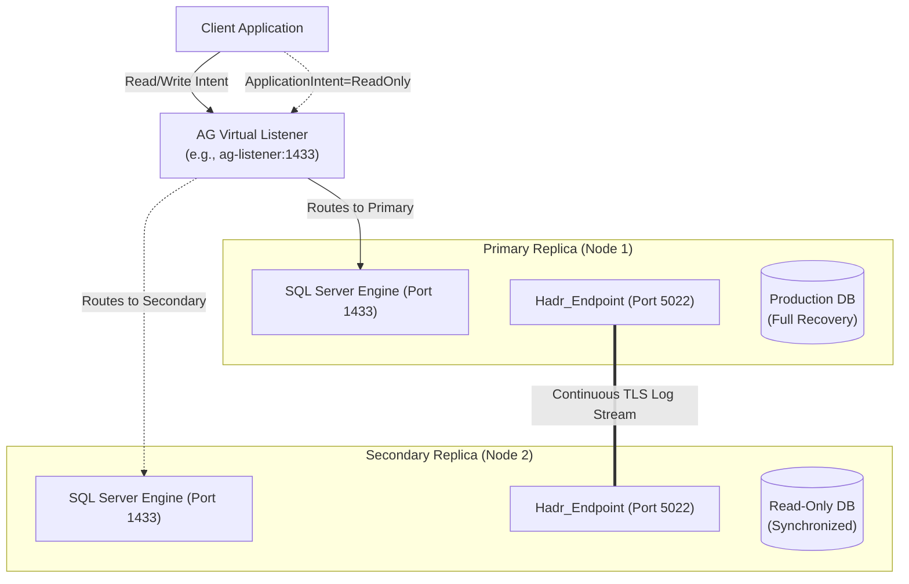
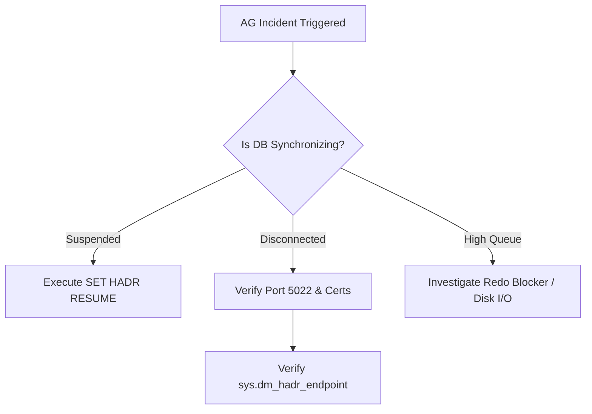

# Microsoft SQL Server Always On Availability Groups (AG) Runbook
**Target Audience:** Lead DBAs, Platform/Infrastructure Engineers, SREs  
**Scope:** SQL Server 2017 / 2019 / 2022 (Windows, Linux, and Hybrid Cross-Platform)  
**Classification:** Operational Runbook / Standard Operating Procedure (SOP)

---

## Table of Contents
1. [Architecture & Cluster Topologies](#1-architecture--cluster-topologies)
2. [Pre-Flight Prerequisites & Network Matrix](#2-pre-flight-prerequisites--network-matrix)
3. [OS-Level HADR Enablement](#3-os-level-hadr-enablement)
4. [Security: Certificate Authentication (Cross-Platform / Workgroup)](#4-security-certificate-authentication-cross-platform--workgroup)
5. [End-to-End T-SQL Deployment](#5-end-to-end-t-sql-deployment)
   - [5.1 Create Endpoints & Grants](#51-step-1-create-endpoints-and-grant-permissions)
   - [5.2 Create Availability Group (Primary)](#52-step-2-create-availability-group-primary)
   - [5.3 Join Secondary & Enable Automatic Seeding](#53-step-3-join-secondary-replica--automatic-seeding)
   - [5.4 Configure AG Listener & Read-Only Routing](#54-step-4-configure-ag-listener--read-only-routing)
6. [Day-2 Operations & Monitoring](#6-day-2-operations--monitoring)
   - [6.1 Health & Synchronization Status Queries](#61-health--synchronization-status-queries)
   - [6.2 RTO/RPO Metrics (Log Send & Redo Queues)](#62-rtorpo-metrics-log-send--redo-queues)
7. [Backup Strategy & Maintenance](#7-backup-strategy--maintenance)
8. [Planned & Unplanned Failover Procedures](#8-planned--unplanned-failover-procedures)
   - [8.1 Graceful Planned Failover (Zero Data Loss)](#81-graceful-planned-failover-zero-data-loss)
   - [8.2 Forced Unplanned Failover (Disaster Recovery)](#82-forced-unplanned-failover-disaster-recovery)
9. [Incident Response & Troubleshooting](#9-incident-response--troubleshooting)
   - [9.1 Endpoint Handshake Failures (Error 1418 / 1474)](#91-incident-1-endpoint-handshake-failure-error-1418--1474)
   - [9.2 Automatic Seeding Stuck or Failed](#92-incident-2-automatic-seeding-stuck-or-failed)
   - [9.3 Replica in NOT SYNCHRONIZING / SUSPECT State](#93-incident-3-replica-in-not-synchronizing--suspect-state)

---

## 1. Architecture & Cluster Topologies



### Choosing the Cluster Type (`CLUSTER_TYPE`)

| Cluster Type | Supported Platforms | Auto-Failover | Best Use Case |
| :--- | :--- | :--- | :--- |
| **`WSFC`** | Windows only | Yes | Enterprise High Availability on Windows domains. |
| **`EXTERNAL`** | Linux only (Pacemaker) | Yes | Enterprise High Availability on Linux. |
| **`NONE`** | Windows, Linux, Hybrid | No (Manual / App orchestrated) | **Cross-Platform (Linux $\leftrightarrow$ Windows)**, Read-Scale out, or Kubernetes/cloud migrations. |

---

## 2. Pre-Flight Prerequisites & Network Matrix

### Port Matrix
* **Port `1433` TCP**: SQL Server Engine / Client Connection traffic / AG Listener.
* **Port `5022` TCP**: Always On Endpoint traffic (Log streaming and Automatic Seeding).

### Database Checklist
- [ ] Database is in **`FULL`** recovery model: `ALTER DATABASE [<DBName>] SET RECOVERY FULL;`
- [ ] At least one **Full Database Backup** has been performed prior to adding to AG.
- [ ] Page Checksum is enabled: `ALTER DATABASE [<DBName>] SET PAGE_CHECKSUM CHECKSUM;`
- [ ] Collation and SQL Server major versions must match.
- [ ] Target disk paths on Secondary must either match Primary or require manual seeding with file relocation.

---

## 3. OS-Level HADR Enablement

Before SQL Server can create endpoints or AGs, Always On must be enabled at the OS layer.

### Windows (PowerShell - Run as Administrator)
```powershell
Enable-SqlAlwaysOn -ServerInstance "localhost" -Force
Restart-Service -Name "MSSQLSERVER"
```

### Linux (Bash - Terminal)
```bash
sudo mssql-conf set hadr.hadrenabled 1
sudo systemctl restart mssql-server
sudo systemctl status mssql-server
```

---

## 4. Security: Certificate Authentication (Cross-Platform / Workgroup)

> [!NOTE]
> Windows Active Directory Kerberos works seamlessly between Windows machines in the same domain. For **Linux-to-Linux**, **Linux-to-Windows**, or **Cross-Domain/Workgroup** setups, **X.509 Certificates** must be used for endpoint authentication.

### Step 4.1: Generate Certificate on Primary (Node 1)
```sql
USE master;
GO
-- 1. Create Master Key
CREATE MASTER KEY ENCRYPTION BY PASSWORD = 'MasterKeyPassword!@#2026';
GO

-- 2. Create Certificate for HADR
CREATE CERTIFICATE AG_Cert_Node1
WITH SUBJECT = 'AG Node1 Mirroring Certificate',
     EXPIRY_DATE = '2036-12-31';
GO

-- 3. Backup Certificate (Public Key only)
BACKUP CERTIFICATE AG_Cert_Node1
TO FILE = '/var/opt/mssql/data/AG_Cert_Node1.cer' -- Linux path or C:\SQLBackup\ on Windows
GO
```

### Step 4.2: Generate Certificate on Secondary (Node 2)
```sql
USE master;
GO
CREATE MASTER KEY ENCRYPTION BY PASSWORD = 'MasterKeyPassword!@#2026';
GO

CREATE CERTIFICATE AG_Cert_Node2
WITH SUBJECT = 'AG Node2 Mirroring Certificate',
     EXPIRY_DATE = '2036-12-31';
GO

BACKUP CERTIFICATE AG_Cert_Node2
TO FILE = '/var/opt/mssql/data/AG_Cert_Node2.cer';
GO
```

### Step 4.3: Copy & Exchange Certificates
* Copy `AG_Cert_Node1.cer` from Node 1 to Node 2.
* Copy `AG_Cert_Node2.cer` from Node 2 to Node 1.

### Step 4.4: Import Certificate & Create Mirroring Logins
*(Execute on **Node 1** to trust Node 2)*
```sql
USE master;
GO
CREATE LOGIN AG_Login_Node2 WITH PASSWORD = 'StrongAuthPassword!@#2026';
CREATE USER AG_User_Node2 FOR LOGIN AG_Login_Node2;
CREATE CERTIFICATE AG_Cert_Node2 
    AUTHORIZATION AG_User_Node2 
    FROM FILE = '/var/opt/mssql/data/AG_Cert_Node2.cer';
GRANT CONNECT ON ENDPOINT::Hadr_endpoint TO [AG_Login_Node2];
GO
```

*(Execute on **Node 2** to trust Node 1)*
```sql
USE master;
GO
CREATE LOGIN AG_Login_Node1 WITH PASSWORD = 'StrongAuthPassword!@#2026';
CREATE USER AG_User_Node1 FOR LOGIN AG_Login_Node1;
CREATE CERTIFICATE AG_Cert_Node1 
    AUTHORIZATION AG_User_Node1 
    FROM FILE = '/var/opt/mssql/data/AG_Cert_Node1.cer';
GRANT CONNECT ON ENDPOINT::Hadr_endpoint TO [AG_Login_Node1];
GO
```

---

## 5. End-to-End T-SQL Deployment

---

### 5.1 Step 1: Create Endpoints and Grant Permissions
*(Execute on **BOTH** Node 1 and Node 2)*

```sql
USE master;
GO

-- Create Endpoint using the respective local certificate
CREATE ENDPOINT [Hadr_endpoint]
    STATE = STARTED
    AS TCP (LISTENER_PORT = 5022, LISTENER_IP = ALL)
    FOR DATABASE_MIRRORING (
        AUTHENTICATION = CERTIFICATE [AG_Cert_Node1], -- Use AG_Cert_Node2 on Node 2
        ENCRYPTION = REQUIRED ALGORITHM AES,
        ROLE = ALL
    );
GO
```

---

### 5.2 Step 2: Create Availability Group (Primary)
*(Execute on **Primary Node 1**)*

```sql
USE master;
GO

-- Set CLUSTER_TYPE = WSFC (Windows Cluster), EXTERNAL (Linux Pacemaker), or NONE (Cross-platform/Read-Scale)
CREATE AVAILABILITY GROUP [AG_CoreBanking]
WITH (
    AUTOMATED_BACKUP_PREFERENCE = SECONDARY,
    DB_FAILOVER = ON,
    DTC_SUPPORT = NONE,
    CLUSTER_TYPE = NONE -- Change to WSFC or EXTERNAL as needed
)
FOR DATABASE [CoreBankingDB]
REPLICA ON 
    N'SQL-NODE-01' WITH (
        ENDPOINT_URL = N'TCP://192.168.10.11:5022',
        AVAILABILITY_MODE = SYNCHRONOUS_COMMIT, -- SYNCHRONOUS_COMMIT or ASYNCHRONOUS_COMMIT
        FAILOVER_MODE = MANUAL,                  -- AUTOMATIC (with WSFC/Pacemaker) or MANUAL
        SEEDING_MODE = AUTOMATIC,                -- Enables SQL Server Direct Seeding
        SECONDARY_ROLE (ALLOW_CONNECTIONS = ALL)
    ),
    N'SQL-NODE-02' WITH (
        ENDPOINT_URL = N'TCP://192.168.10.12:5022',
        AVAILABILITY_MODE = SYNCHRONOUS_COMMIT,
        FAILOVER_MODE = MANUAL,
        SEEDING_MODE = AUTOMATIC,
        SECONDARY_ROLE (ALLOW_CONNECTIONS = ALL)
    );
GO
```

---

### 5.3 Step 3: Join Secondary Replica & Automatic Seeding
*(Execute on **Secondary Node 2**)*

```sql
USE master;
GO

-- 1. Join AG
ALTER AVAILABILITY GROUP [AG_CoreBanking] JOIN WITH (CLUSTER_TYPE = NONE);
GO

-- 2. Grant permission for automatic seeding (Direct streaming of data files)
ALTER AVAILABILITY GROUP [AG_CoreBanking] GRANT CREATE ANY DATABASE;
GO
```

---

### 5.4 Step 4: Configure AG Listener & Read-Only Routing

#### 1. Create AG Listener
*(Applicable when `CLUSTER_TYPE` is `WSFC` or `EXTERNAL`)*
```sql
USE master;
GO
ALTER AVAILABILITY GROUP [AG_CoreBanking]
ADD LISTENER N'ag-corebanking-listener' (
    WITH IP ((N'192.168.10.100', N'255.255.255.0')), 
    PORT = 1433
);
GO
```

#### 2. Configure Read-Only Routing URLs
*(Execute on Primary)*
```sql
USE master;
GO

-- Set read-only routing URLs
ALTER AVAILABILITY GROUP [AG_CoreBanking]
MODIFY REPLICA ON N'SQL-NODE-01' WITH (
    SECONDARY_ROLE (READ_ONLY_ROUTING_URL = N'TCP://192.168.10.11:1433')
);

ALTER AVAILABILITY GROUP [AG_CoreBanking]
MODIFY REPLICA ON N'SQL-NODE-02' WITH (
    SECONDARY_ROLE (READ_ONLY_ROUTING_URL = N'TCP://192.168.10.12:1433')
);

-- Define Routing List (Direct read traffic to Node 2 when Node 1 is primary)
ALTER AVAILABILITY GROUP [AG_CoreBanking]
MODIFY REPLICA ON N'SQL-NODE-01' WITH (
    PRIMARY_ROLE (READ_ONLY_ROUTING_LIST = (N'SQL-NODE-02', N'SQL-NODE-01'))
);

ALTER AVAILABILITY GROUP [AG_CoreBanking]
MODIFY REPLICA ON N'SQL-NODE-02' WITH (
    PRIMARY_ROLE (READ_ONLY_ROUTING_LIST = (N'SQL-NODE-01', N'SQL-NODE-02'))
);
GO
```

---

## 6. Day-2 Operations & Monitoring

### 6.1 Health & Synchronization Status Queries
*(Execute on any replica)*

```sql
SELECT 
    ag.name AS [AG_Name],
    ar.replica_server_name AS [Replica],
    d.name AS [Database],
    drs.synchronization_state_desc AS [Sync_State],
    drs.synchronization_health_desc AS [Health],
    drs.database_state_desc AS [DB_State],
    drs.is_suspended AS [Is_Suspended],
    drs.suspend_reason_desc AS [Suspend_Reason]
FROM sys.dm_hadr_database_replica_states drs
JOIN sys.availability_groups ag ON drs.group_id = ag.group_id
JOIN sys.availability_replicas ar ON drs.replica_id = ar.replica_id
JOIN sys.databases d ON drs.database_id = d.database_id
ORDER BY ag.name, ar.replica_server_name;
```

---

### 6.2 RTO/RPO Metrics (Log Send & Redo Queues)
Tracks potential data loss (RPO) and recovery time (RTO) in seconds.

```sql
SELECT 
    ar.replica_server_name AS [Replica],
    d.name AS [Database],
    drs.log_send_queue_size AS [LogSendQueue_KB],
    drs.log_send_rate AS [LogSendRate_KB_sec],
    CASE 
        WHEN drs.log_send_rate > 0 
        THEN drs.log_send_queue_size / drs.log_send_rate 
        ELSE 0 
    END AS [Estimated_Data_Loss_RPO_Sec],
    drs.redo_queue_size AS [RedoQueue_KB],
    drs.redo_rate AS [RedoRate_KB_sec],
    CASE 
        WHEN drs.redo_rate > 0 
        THEN drs.redo_queue_size / drs.redo_rate 
        ELSE 0 
    END AS [Estimated_Recovery_Time_RTO_Sec]
FROM sys.dm_hadr_database_replica_states drs
JOIN sys.availability_replicas ar ON drs.replica_id = ar.replica_id
JOIN sys.databases d ON drs.database_id = d.database_id
WHERE drs.is_local = 0;
```

---

## 7. Backup Strategy & Maintenance

> [!IMPORTANT]
> - **Full Backups**: When taken on a Secondary replica, they are *copy-only* (`WITH COPY_ONLY`).
> - **Log Backups**: Standard log backups taken on any replica form a single coherent LSN log chain. Do **NOT** use `WITH COPY_ONLY` for log backups.
> - **Differential Backups**: Must **ONLY** be executed on the **Primary** replica.

### Standard Maintenance Script Check
```sql
-- Query to include in backup jobs to verify if current node should run the backup
IF (sys.fn_hadr_backup_is_preferred_replica(N'CoreBankingDB') = 1)
BEGIN
    BACKUP LOG [CoreBankingDB] 
    TO DISK = N'\\backup_share\CoreBankingDB_Log.trn' 
    WITH COMPRESSION, STATS = 10;
END
```

---

## 8. Planned & Unplanned Failover Procedures

### 8.1 Graceful Planned Failover (Zero Data Loss)

1. **Verify Replicas are in `SYNCHRONIZED` state**:
   Ensure `synchronization_state_desc = 'SYNCHRONIZED'` on the target Secondary.
2. **Execute Failover Command on Target Secondary (Node 2)**:
   ```sql
   -- For WSFC or Pacemaker (EXTERNAL)
   ALTER AVAILABILITY GROUP [AG_CoreBanking] FAILOVER;

   -- For CLUSTER_TYPE = NONE (Linux/Cross-Platform/Read-Scale)
   -- Step A: On Old Primary (Node 1) -> Set to Secondary
   ALTER AVAILABILITY GROUP [AG_CoreBanking] SET (ROLE = SECONDARY);

   -- Step B: On New Primary (Node 2) -> Set to Primary
   ALTER AVAILABILITY GROUP [AG_CoreBanking] SET (ROLE = PRIMARY);
   ```

---

### 8.2 Forced Unplanned Failover (Disaster Recovery)
> [!CAUTION]
> Performing a forced failover when `synchronization_state_desc` is not `SYNCHRONIZED` may lead to data loss.

*(Execute on Secondary Node 2 during Primary outage)*

```sql
-- Force failover (allows data loss)
ALTER AVAILABILITY GROUP [AG_CoreBanking] FORCE_FAILOVER_ALLOW_DATA_LOSS;
GO

-- When the old Primary comes back online, its databases will be in SUSPENDED state.
-- On old Primary, resume synchronization:
ALTER DATABASE [CoreBankingDB] SET HADR RESUME;
GO
```

---

## 9. Incident Response & Troubleshooting



---

### 9.1 Incident 1: Endpoint Handshake Failure (Error 1418 / 1474)
**Symptom:** AG replicas cannot connect; error `An error occurred while receiving data: '10054(An existing connection was forcibly closed by the remote host)'`.

#### Resolution:
1. **Check Endpoint States:**
   ```sql
   SELECT name, state_desc, port FROM sys.tcp_endpoints WHERE type = 4;
   ```
   If state is `STOPPED`, run: `ALTER ENDPOINT [Hadr_endpoint] STATE = STARTED;`
2. **Verify Certificate Expiration & Permissions:**
   ```sql
   SELECT name, start_date, expiry_date FROM sys.certificates WHERE name LIKE 'AG_%';
   ```
3. **Verify Network Reachability:**
   ```powershell
   Test-NetConnection -ComputerName 192.168.10.12 -Port 5022
   ```

---

### 9.2 Incident 2: Automatic Seeding Stuck or Failed
**Symptom:** Secondary database remains in `RESTORING` or never populates.

#### Investigation Query:
```sql
SELECT 
    start_time,
    completion_time,
    ag.name AS [AG_Name],
    current_state,
    failure_state_desc,
    error_code,
    message
FROM sys.dm_hadr_automatic_seeding seed
JOIN sys.availability_groups ag ON seed.ag_id = ag.group_id;

-- Detailed physical transfer throughput
SELECT 
    local_database_name,
    role_desc,
    total_disk_io_wait_time_ms,
    transferred_size_bytes / 1024 / 1024 AS [Transferred_MB],
    database_size_bytes / 1024 / 1024 AS [Total_MB]
FROM sys.dm_hadr_physical_seeding_stats;
```

#### Fix:
If seeding failed due to timeout or path mismatch:
1. Verify `GRANT CREATE ANY DATABASE` was executed on the Secondary.
2. If disk folder paths differ between Linux (`/var/opt/mssql/data`) and Windows (`D:\SQLData`), use **Manual Backup & Restore with `WITH MOVE`**, then join using:
   ```sql
   ALTER DATABASE [CoreBankingDB] SET HADR AVAILABILITY GROUP = [AG_CoreBanking];
   ```

---

### 9.3 Incident 3: Replica in NOT SYNCHRONIZING / SUSPECT State
**Symptom:** `synchronization_state_desc` shows `NOT SYNCHRONIZING` or `is_suspended = 1`.

#### Resolution:
```sql
-- Step 1: Identify suspend reason
SELECT database_id, is_suspended, suspend_reason_desc 
FROM sys.dm_hadr_database_replica_states 
WHERE is_local = 1;

-- Step 2: Resume HADR stream
ALTER DATABASE [CoreBankingDB] SET HADR RESUME;
```

---
*End of Always On AG Runbook.*
