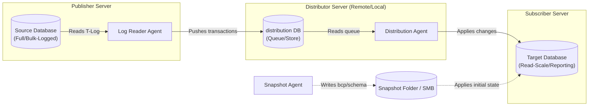
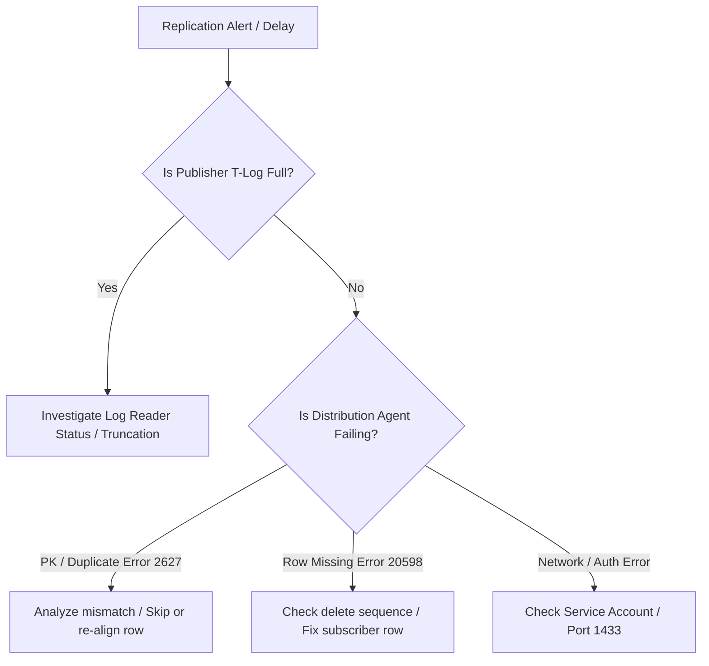

# Microsoft SQL Server Transactional Replication Runbook
**Target Audience:** Database Administrators, Site Reliability Engineers, DevOps Engineers  
**Scope:** SQL Server 2017 / 2019 / 2022 (Windows & Linux)  
**Classification:** Operational Runbook / Standard Operating Procedure (SOP)

---

## Table of Contents
1. [Architecture & Topology](#1-architecture--topology)
2. [Pre-Flight Prerequisites & Checklist](#2-pre-flight-prerequisites--checklist)
3. [Deployment Procedures (T-SQL)](#3-deployment-procedures-t-sql)
   - [3.1 Configure Distributor](#31-step-1-configure-the-distributor)
   - [3.2 Enable Publication & Add Articles](#32-step-2-enable-database-and-create-publication)
   - [3.3 Standard Snapshot Subscription](#33-step-3a-create-subscription-standard-snapshot)
   - [3.4 Enterprise Large-DB Subscription (Initialize with Backup)](#34-step-3b-enterprise-subscription-initialize-with-backup)
4. [Day-2 Operations & Monitoring](#4-day-2-operations--monitoring)
   - [4.1 Latency Monitoring via Tracer Tokens](#41-latency-monitoring-via-tracer-tokens)
   - [4.2 Agent Health & Undelivered Commands Query](#42-agent-health--undelivered-commands-query)
5. [Schema Changes & Online Maintenance](#5-schema-changes--online-maintenance)
6. [Incident Response & Troubleshooting](#6-incident-response--troubleshooting)
   - [6.1 Transaction Log Growing on Publisher (REPLICATION wait)](#61-incident-1-transaction-log-exhaustion-on-publisher)
   - [6.2 Duplicate Key / Row Missing at Subscriber](#62-incident-2-data-conflict-error-2627-or-20598)
   - [6.3 Agent Failures & Network Timeouts](#63-incident-3-agent-failures--network-disconnects)
7. [Decommissioning & Teardown](#7-decommissioning--teardown)

---

## 1. Architecture & Topology



### Topology Recommendations
* **Small-to-Medium Workloads:** Local Distributor (Publisher acts as Distributor).
* **High-Throughput / Multi-Publication Environments:** Remote Dedicated Distributor to offload distribution DB I/O and Agent CPU from the transactional engine.
* **Network & Ports:** 
  * Port `1433` (SQL Server TCP)
  * Port `445` (SMB Snapshot share, or NFS/local mount for Linux)

---

## 2. Pre-Flight Prerequisites & Checklist

Run this checklist on all participating instances prior to executing deployment scripts.

- [ ] **Primary Keys:** Every replicated table **MUST** have a clustered or non-clustered Primary Key.
- [ ] **SQL Server Agent:** Must be set to `Automatic` startup and currently running on Publisher, Distributor, and Subscriber.
  * *Linux:* Verify with `sudo systemctl status mssql-server-agent`.
- [ ] **Snapshot Share:** Dedicated disk path accessible via UNC path (e.g., `\\distributor.domain.local\repldata`) with full Read/Write permissions for the SQL Server Agent service accounts.
- [ ] **Service Accounts & Authentication:**
  * Domain Service Accounts or dedicated SQL logins with least-privilege replication roles.
- [ ] **Identity Columns:** Determine whether `IDENTITY` columns need `NOT FOR REPLICATION` attribute preserved.
- [ ] **Foreign Keys & Triggers:** Ensure foreign keys and triggers on the Subscriber are marked `NOT FOR REPLICATION` to avoid constraint violations during write replication.

---

## 3. Deployment Procedures (T-SQL)

> [!IMPORTANT]
> Replace placeholders `<DistributorServer>`, `<PublisherServer>`, `<SubscriberServer>`, `<SourceDB>`, `<TargetDB>`, and passwords before execution.

---

### 3.1 Step 1: Configure the Distributor
*(Execute on the **Distributor** instance)*

```sql
USE master;
GO

-- 1. Install Distributor
EXEC sp_adddistributor 
    @distributor = N'<DistributorServer>', 
    @password = N'StrongPassword!@#2026';
GO

-- 2. Create Distribution Database
EXEC sp_adddistributiondb 
    @database = N'distribution', 
    @data_folder = N'D:\SQLData', 
    @log_folder = N'L:\SQLLog', 
    @min_distretention = 0, 
    @max_distretention = 72, -- Hours to retain transactions
    @history_retention = 48;
GO

-- 3. Register Publisher at Distributor
EXEC sp_adddistpublisher 
    @publisher = N'<PublisherServer>', 
    @distribution_db = N'distribution', 
    @security_mode = 1, -- 1 = Windows Integrated, 0 = SQL Auth
    @working_directory = N'\\<DistributorServer>\repldata',
    @trusted = N'false', 
    @thirdparty_flag = 0, 
    @publisher_type = N'MSSQLSERVER';
GO
```

---

### 3.2 Step 2: Enable Database and Create Publication
*(Execute on the **Publisher** instance)*

```sql
USE master;
GO

-- 1. Enable replication on the source database
EXEC sp_replicationdboption 
    @dbname = N'<SourceDB>', 
    @optname = N'publish', 
    @value = N'true';
GO

USE [<SourceDB>];
GO

-- 2. Create the Transactional Publication
EXEC sp_addpublication 
    @publication = N'Pub_CoreBanking_Tx', 
    @description = N'Transactional publication for Core Banking', 
    @sync_method = N'concurrent', 
    @retention = 72, 
    @allow_push = N'true', 
    @allow_pull = N'true', 
    @allow_anonymous = N'false', 
    @immediate_sync = N'false', -- Must be false to allow dynamic article addition without full snapshot regeneration
    @status = N'active', 
    @independent_agent = N'true';
GO

-- 3. Configure Snapshot Agent
EXEC sp_addpublication_snapshot 
    @publication = N'Pub_CoreBanking_Tx', 
    @frequency_type = 1; -- On-demand
GO

-- 4. Add Articles (Tables)
-- Repeat sp_addarticle for each table
EXEC sp_addarticle 
    @publication = N'Pub_CoreBanking_Tx', 
    @article = N'accounts', 
    @source_owner = N'dbo', 
    @source_object = N'accounts', 
    @type = N'logbased', 
    @description = N'Accounts article', 
    @pre_creation_cmd = N'drop', 
    @schema_option = 0x000000000803509F, -- Replicates PK, indexes, constraints, identity
    @destination_table = N'accounts', 
    @destination_owner = N'dbo';

EXEC sp_addarticle 
    @publication = N'Pub_CoreBanking_Tx', 
    @article = N'transactions', 
    @source_owner = N'dbo', 
    @source_object = N'transactions', 
    @type = N'logbased', 
    @description = N'Transactions article', 
    @pre_creation_cmd = N'drop', 
    @schema_option = 0x000000000803509F, 
    @destination_table = N'transactions', 
    @destination_owner = N'dbo';
GO
```

---

### 3.3 Step 3A: Create Subscription (Standard Snapshot)
*Best for: Databases < 200 GB or low-write environments.*

```sql
USE [<SourceDB>];
GO

-- 1. Register Push Subscription on Publisher
EXEC sp_addsubscription 
    @publication = N'Pub_CoreBanking_Tx', 
    @subscriber = N'<SubscriberServer>', 
    @destination_db = N'<TargetDB>', 
    @subscription_type = N'Push', 
    @sync_type = N'automatic', -- Generates and applies snapshot
    @article = N'all', 
    @update_mode = N'read only', 
    @subscriber_type = 0;
GO

-- 2. Configure Push Subscription Agent
EXEC sp_addpushsubscription_agent 
    @publication = N'Pub_CoreBanking_Tx', 
    @subscriber = N'<SubscriberServer>', 
    @subscriber_db = N'<TargetDB>', 
    @subscriber_security_mode = 1, -- Windows Auth
    @frequency_type = 64; -- Continuous
GO

-- 3. Start the Snapshot Agent to initialize subscriber
EXEC sp_startpublication_snapshot @publication = N'Pub_CoreBanking_Tx';
GO
```

---

### 3.4 Step 3B: Enterprise Subscription (Initialize with Backup)
*Best for: Multi-terabyte databases where snapshot generation causes unacceptable disk/network bottlenecks.*

```sql
-- 1. Take a full or differential backup on Publisher
BACKUP DATABASE [<SourceDB>] 
TO DISK = N'\\backup_share\SourceDB_ReplInit.bak' 
WITH INIT, COMPRESSION, STATS = 10;
GO

-- 2. Restore database on Subscriber (DO NOT LEAVE IN NORECOVERY; RECOVER COMPLETELY)
RESTORE DATABASE [<TargetDB>] 
FROM DISK = N'\\backup_share\SourceDB_ReplInit.bak' 
WITH MOVE N'SourceDB_Data' TO N'D:\SQLData\<TargetDB>.mdf',
     MOVE N'SourceDB_Log'  TO N'L:\SQLLog\<TargetDB>_log.ldf',
     RECOVERY, REPLACE, STATS = 10;
GO

-- 3. On Publisher: Enable subscription using backup sync_type
USE [<SourceDB>];
GO

EXEC sp_addsubscription 
    @publication = N'Pub_CoreBanking_Tx', 
    @subscriber = N'<SubscriberServer>', 
    @destination_db = N'<TargetDB>', 
    @subscription_type = N'Push', 
    @sync_type = N'initialize with backup', 
    @backupdevicetype = N'disk', 
    @backupdevicename = N'\\backup_share\SourceDB_ReplInit.bak', 
    @article = N'all', 
    @update_mode = N'read only';

EXEC sp_addpushsubscription_agent 
    @publication = N'Pub_CoreBanking_Tx', 
    @subscriber = N'<SubscriberServer>', 
    @subscriber_db = N'<TargetDB>', 
    @subscriber_security_mode = 1, 
    @frequency_type = 64;
GO
```

---

## 4. Day-2 Operations & Monitoring

### 4.1 Latency Monitoring via Tracer Tokens
Tracer tokens measure exact end-to-end latency: **Publisher $\rightarrow$ Distributor** and **Distributor $\rightarrow$ Subscriber**.

*(Execute on **Publisher** against the published database)*

```sql
USE [<SourceDB>];
GO

-- 1. Post a new tracer token
DECLARE @token_id INT;
EXEC sp_posttracertoken 
    @publication = N'Pub_CoreBanking_Tx', 
    @tracer_token_id = @token_id OUTPUT;

SELECT @token_id AS [PostedTokenID], GETDATE() AS [TokenPostedTime];
GO

-- 2. Check token propagation latency (Wait ~5-10 seconds after posting)
EXEC sp_helptracertokenhistory 
    @publication = N'Pub_CoreBanking_Tx', 
    @tracer_token_id = <PostedTokenID>;
GO
```

---

### 4.2 Agent Health & Undelivered Commands Query
*(Execute on the **Distributor**)*

```sql
USE distribution;
GO

-- 1. Check undelivered commands and pending transactions per subscription
SELECT 
    p.publication AS [Publication],
    a.article AS [Article],
    s.name AS [SubscriberServer],
    sub.subscriber_db AS [SubscriberDB],
    undelivered.undeliv_cmds AS [UndeliveredCommands]
FROM dbo.MSdistribution_status undelivered
JOIN dbo.MSdistribution_agents a_agent ON undelivered.agent_id = a_agent.id
JOIN dbo.MSpublications p ON a_agent.publication = p.publication
JOIN dbo.MSarticles a ON undelivered.article_id = a.article_id
JOIN master.sys.servers s ON a_agent.subscriber_id = s.server_id
JOIN dbo.MSsubscriptions sub ON a_agent.id = sub.agent_id
WHERE undelivered.undeliv_cmds > 0
ORDER BY undelivered.undeliv_cmds DESC;

-- 2. Check recent Distribution Agent errors
SELECT TOP 25
    time AS [ErrorTime],
    error_code AS [ErrorCode],
    error_text AS [ErrorMessage]
FROM dbo.MSdistribution_history
WHERE error_id <> 0
ORDER BY time DESC;
```

---

## 5. Schema Changes & Online Maintenance

### Adding a New Table without Invalidating Existing Subscriptions
> [!NOTE]
> Because we set `@immediate_sync = 'false'`, adding a new article only generates a snapshot for that specific article, leaving existing tables untouched.

```sql
USE [<SourceDB>];
GO

-- 1. Add the new article
EXEC sp_addarticle 
    @publication = N'Pub_CoreBanking_Tx', 
    @article = N'audit_logs', 
    @source_owner = N'dbo', 
    @source_object = N'audit_logs', 
    @force_invalidate_snapshot = 1;

-- 2. Refresh subscription to include the new article
EXEC sp_refreshsubscriptions @publication = N'Pub_CoreBanking_Tx';

-- 3. Run the Snapshot Agent (It will ONLY snapshot 'audit_logs')
EXEC sp_startpublication_snapshot @publication = N'Pub_CoreBanking_Tx';
```

### Adding / Dropping Columns on Replicated Tables
SQL Server automatically replicates standard schema alterations performed on the Publisher:
```sql
-- This will automatically replicate to all active Subscribers:
ALTER TABLE dbo.accounts ADD branch_code VARCHAR(10) NULL;
```

---

## 6. Incident Response & Troubleshooting



---

### 6.1 Incident 1: Transaction Log Exhaustion on Publisher
**Symptom:** `log_reuse_wait_desc = 'REPLICATION'` in `sys.databases`. Log backups do not free space.

```sql
-- Check log reuse wait
SELECT name, log_reuse_wait_desc FROM sys.databases WHERE name = N'<SourceDB>';

-- Root Cause 1: Log Reader Agent is stopped or failing
-- Solution: Start the Log Reader Agent job in SQL Server Agent.

-- Root Cause 2: Unreplicated transactions stuck in log
-- Emergency Action: If replication is permanently abandoned and blocking T-Log truncation:
-- EXEC sp_repldone @xactid = NULL, @xact_segno = NULL, @numtrans = 0, @time = 0, @reset = 1;
```

---

### 6.2 Incident 2: Data Conflict (Error 2627 or 20598)
**Symptom:** Distribution Agent fails with `Cannot insert duplicate key row in object...` (Error 2627) or `The row was not found at the Subscriber when applying the replicated command` (Error 20598).

#### Resolution Strategy:
1. **Identify the transaction sequence:**
   ```sql
   USE distribution;
   EXEC sp_browsereplcmds 
       @xact_seqno_start = '<xact_seqno_from_error_log>', 
       @xact_seqno_end   = '<xact_seqno_from_error_log>';
   ```
2. **Fix Subscriber Data:** Manually insert/delete the conflicting row at the Subscriber to match Publisher state.
3. **Agent Profile (SkipErrors - Use with Caution):**
   * If authorized by data owners, add `-SkipErrors 2601:2627:20598` to the Distribution Agent profile temporarily to bypass the command and let the queue proceed.

---

### 6.3 Incident 3: Agent Failures & Network Disconnects
**Symptom:** Agent reports `Login failed for user` or `Query timeout expired`.

1. **Verify Agent Job History:**
   * Open SQL Server Agent $\rightarrow$ Jobs $\rightarrow$ View History on `<PublisherServer>-<SourceDB>-<PubName>-<ID>`.
2. **Verify Port & Firewall:**
   ```powershell
   # Test connectivity from Distributor to Subscriber
   Test-NetConnection -ComputerName <SubscriberServer> -Port 1433
   ```
3. **Restart Agents:**
   Restart the specific SQL Server Agent job for the stuck Log Reader or Distribution Agent.

---

## 7. Decommissioning & Teardown

To cleanly remove replication without leaving orphaned metadata or locks:

```sql
-- 1. On Publisher: Drop Subscription
USE [<SourceDB>];
EXEC sp_dropsubscription 
    @publication = N'Pub_CoreBanking_Tx', 
    @subscriber = N'<SubscriberServer>', 
    @destination_db = N'<TargetDB>', 
    @article = N'all';

-- 2. On Publisher: Drop Publication
EXEC sp_droppublication 
    @publication = N'Pub_CoreBanking_Tx';

-- 3. On Publisher: Disable Database Replication
USE master;
EXEC sp_replicationdboption 
    @dbname = N'<SourceDB>', 
    @optname = N'publish', 
    @value = N'false';

-- 4. On Distributor: Remove Publisher & Distributor
EXEC sp_dropdistpublisher @publisher = N'<PublisherServer>';
EXEC sp_dropdistributiondb @database = N'distribution';
EXEC sp_dropdistributor @no_checks = 1;
GO
```

---
*End of Runbook.*
